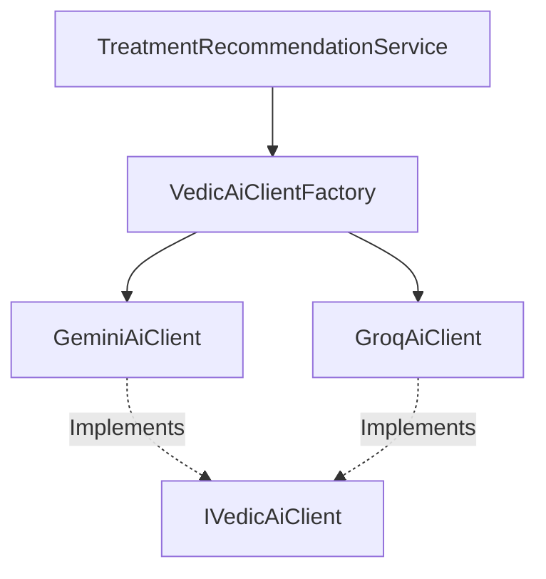

# Backend AI Client Architecture

This document explains the C# backend AI architecture, service interface mappings, and integration models.

---

## 1. Architectural Layout

The AI subsystem utilizes a **Factory Pattern** to resolve client integrations at runtime, allowing the portal to switch providers (Gemini or Groq) dynamically through configuration profiles.



---

## 2. Interface Definition (`IVedicAiClient`)

All AI integrations implement the unified `IVedicAiClient` contract:

```csharp
public interface IVedicAiClient
{
    string ProviderName { get; }
    
    Task<TreatmentRecommendationDto?> GenerateClinicalRecommendationAsync(
        Patient patient,
        Condition condition,
        IEnumerable<HerbalMedicine> candidateMedicines,
        IEnumerable<YogaAsana> candidateYoga,
        IEnumerable<DietaryItem> candidateDietary,
        string apiKey,
        string modelName,
        string? customClinicalNotes = null);

    Task<TreatmentRecommendationDto?> SuggestAdjustmentAsync(
        Patient patient,
        Condition condition,
        TreatmentPlanResponseDto currentPlan,
        IEnumerable<TreatmentOutcomeDto> outcomes,
        string apiKey,
        string modelName);
}
```

---

## 3. Client Implementations

### A. Google Gemini Client (`GeminiAiClient.cs`)
*   **Provider Name:** `"Gemini"`
*   **Model Default:** `gemini-1.5-flash`
*   **Target Endpoint:** `https://generativelanguage.googleapis.com/v1beta/models/{model}:generateContent?key={apiKey}`
*   **Response Formatting:** Requests strict JSON outputs using:
    ```csharp
    generationConfig = new { responseMimeType = "application/json" }
    ```
*   **Adjustments Support:** Fully supports `SuggestAdjustmentAsync`, formatting patient clinical outcomes into chronological prompts.

### B. Groq Client (`GroqAiClient.cs`)
*   **Provider Name:** `"Groq"`
*   **Model Default:** `llama-3.3-70b-versatile`
*   **Target Endpoint:** `https://api.groq.com/openai/v1/chat/completions`
*   **Response Formatting:** Leverages OpenAI-compatible parameters:
    ```csharp
    response_format = new { type = "json_object" }
    ```
*   **Adjustments Support:** `SuggestAdjustmentAsync` is currently **unimplemented** for Groq (returns `null`), so calculations must route to Gemini if adjustments are requested.

---

## 4. Prompt Engineering & Grounding

To prevent hallucinations, the engine uses **Grounding Retrieval**:
1.  **Retrieve:** Before calling the AI, the service retrieves all candidates matching the condition and patient's Prakriti from SQL Server.
2.  **Serialize:** Formats these candidate arrays into JSON lists.
3.  **Inject:** Pass these JSON candidates into the system prompt, instructing the model to *select from the candidates* rather than invent new medications or dosages.
4.  **Parse:** Deserialize the JSON response back into DTO classes to return to the controller.

---

## 5. Options & Feature Flagging (`appsettings.json`)

AI settings are controlled via the `AiSettings` configuration block:

```json
"AiSettings": {
  "Enabled": true,
  "Provider": "Gemini",
  "ApiKey": "",
  "ModelName": "gemini-1.5-flash",
  "EnableFallback": true,
  "Features": {
    "Recommendations": true,
    "SushrutaAssistant": false,
    "ResearchAnalyzer": false
  }
}
```

*   **Enabled:** Global switch toggling AI.
*   **EnableFallback:** If true, failure/errors in AI client execution will trigger an automatic fallback to local rule-based database calculation engines.
*   **Features:** Granular flags enabling/disabling recommendations, chatbot helpers, and research analysis tools.
